# 🎨 Color Bakery

### Documentación de la aplicación
## Idea de la Aplicación
La aplicación que he desarrollado, ColorBakery, trata sobre colores, busca las paletas de colores facilitando  un color base y ademas
ofrece la opción de obtener los colores más representativos de una imagen que el usuario pueda cargar desde una URL dada.
Su uso y utilidad están principalmente enfocados en artistas, desarrolladores web, diseñadores UI/UX y tambien en cualquier
persona interesada en el color desde una perspectiva práctica.

ColorBakery ofrece la posibilidad de generar colores que puedan ayudar al diseñador interesado a inspirarse para su nuevo proyecto, dandole un punto de color a su idea, ademas
permite generar paletas a partir del color generado.

Desde la aplicación el diseñador/usuario puede crear y editar sus propios proyectos pudiendo guardar las paletas de colores necesarias para llevarlo a cabo

Otra de las caracteristicas que ofrece es permitir mantener una lista de colores favoritos.

## Descripción del Proyecto
El proyecto tiene como objetivo ser práctico, facilitando el uso de colores, rangos y paletas para ayudar en el diseño. Tambien permite gestionar proyectos, ando la opcion de guardar tanto las paletas como los colores y poder usarlos en el momento necesario.

## Características Planificadas
Desde la página de inicio la aplicación ya permite hacer busqueda de colores y generar paletas, aunque lo mas interesante es registrarse en la aplicación y asi tener acceso a la creación de nuestros propios proyectos.
Una vez logueado el usuario podra crear proyectos y generar colores que podra guardar en favoritos.

La aplicación proporciona varias características útiles para la exploración y gestión de colores:
- **Búsqueda de paletas por código de color:** Los usuarios pueden buscar paletas basadas en un código de color HEX o RGB, lo que les permite encontrar combinaciones armoniosas rápidamente.
- **Extracción de colores de imágenes:** Permite a los usuarios cargar una imagen y obtener los colores más representativos de ella, lo que les da una forma visualmente inspiradora de seleccionar colores para sus proyectos.
- **Generación de colores aleatorios:** Ofrece una opción para generar colores aleatorios, lo que puede ser útil para la exploración creativa y la generación de ideas frescas.
- **Gestión de proyectos:** Permite a los usuarios crear y gestionar proyectos, asociando paletas de colores con cada proyecto para una mejor organización y colaboración.
- **Lista de colores favoritos:** Los usuarios pueden guardar sus colores favoritos para acceder fácilmente a ellos en futuros proyectos.

## Tecnología a Utilizar
El desarrollo de ColorBakery se basa en las siguientes tecnologías; además de Vue.js junto con Pinia que seran las tecnologias principales empleadas para el frontend, para el backend he usado Laravel y DockerCompose para la implementación y administración de contenedores., ese seria el stack en el que se ha realizado el proyecto completo
En el desarrollo de la aplicación he usado la libreria de Javascript [ColorThief](https://www.npmjs.com/package/color-thief) para obtener los colores de las imagenes y para las paletas de color he usado [TheColorApi](https://www.thecolorapi.com/), una API que a partir de un color devuelve paletas de colores de varios tipos
Ademas de estas tecnologías tambien he empleado [FontAwesome](https://fontawesome.com/) para los iconos de mi aplicación y para las imagenes la IA [DALLE-3](https://openai.com/dall-e-3)

En el desarrollo he usado dos IDES de JetBrains, WebStorm para el desarrollo del frontend y PHPStorm para el backend. El docker compose esta realizado en VisualStudioCode

## Público Objetivo
ColorBakery está dirigido principalmente a profesionales del diseño, incluyendo diseñadores web, diseñadores gráficos, artistas digitales e ilustradores.
También es útil para cualquier persona que necesite trabajar con colores en proyectos creativos, proporcionando herramientas y recursos para facilitar la exploración y selección de colores adecuados.

# Estructura de la aplicación

## Home
La aplicación ColorBakery comienza en la página de inicio. Aquí se encuentra la lógica para ingresar colores y URLs de imágenes, así como para mostrar los resultados 
de las paletas de colores generadas.

Función de Validación de Color: Verifica si el color ingresado es válido en formato HEX o RGB.
Conversión de RGB a HEX: Convierte un color de formato RGB a HEX.
Validación de URL de Imagen: Comprueba si la URL de la imagen ingresada es válida.
Envío de Formularios: Maneja el envío de formularios tanto para colores como para imágenes.
Selección de Proyectos: Permite al usuario seleccionar un proyecto existente para guardar la paleta generada o crear uno nuevo.
Interacción con Resultados: Muestra los resultados de las paletas de colores generadas, permitiendo al usuario guardarlas en proyectos seleccionados.
El home utiliza otros componentes secundarios como ResultadoColor y ResultadoImagen para mostrar los resultados de las paletas de colores generadas a partir de colores ingresados manualmente o imágenes cargadas por el usuario. Además, utiliza un modal para seleccionar proyectos donde se guardarán las paletas generadas.

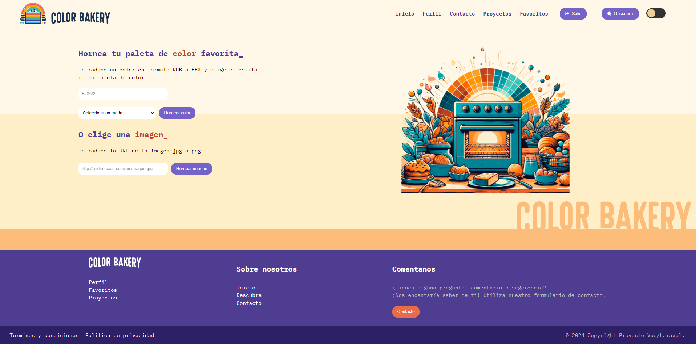

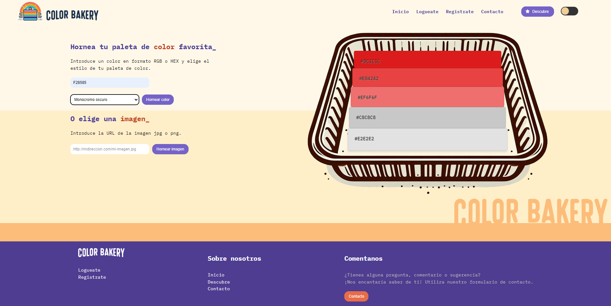

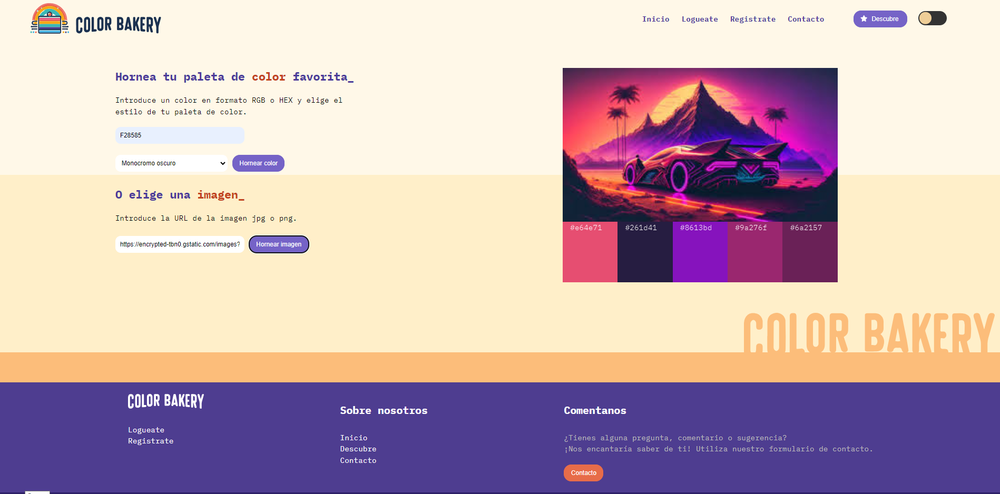

## Formulario de registro y login

ColorBakey permite al usuario loguarse y acceder a diferentes funcionalidades. Para ello dispone de un formulario validado

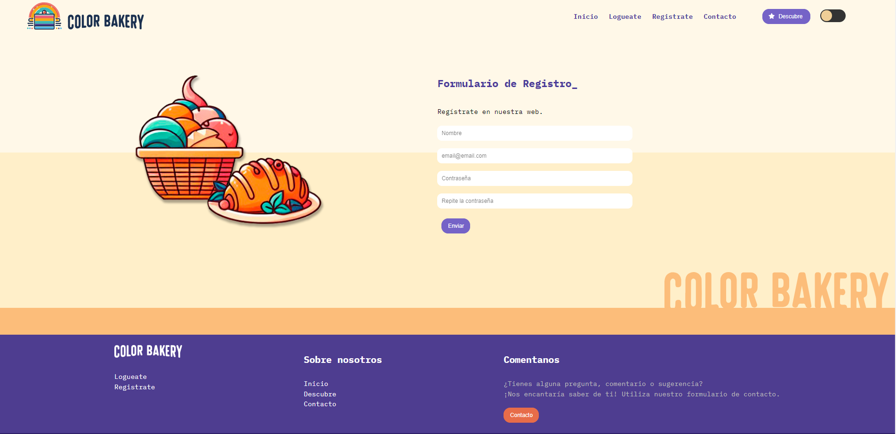

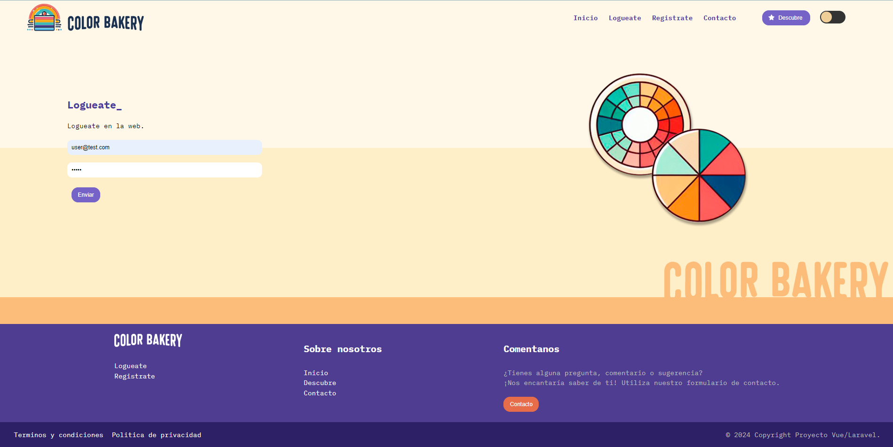

## Sección Descubre

Una vez logueado el usuario, ademas de tener acceso a su perfil, en Descubre podrá guardar los colores generados en favoritos y ademas podra generar paletas de color a partir de ellos.

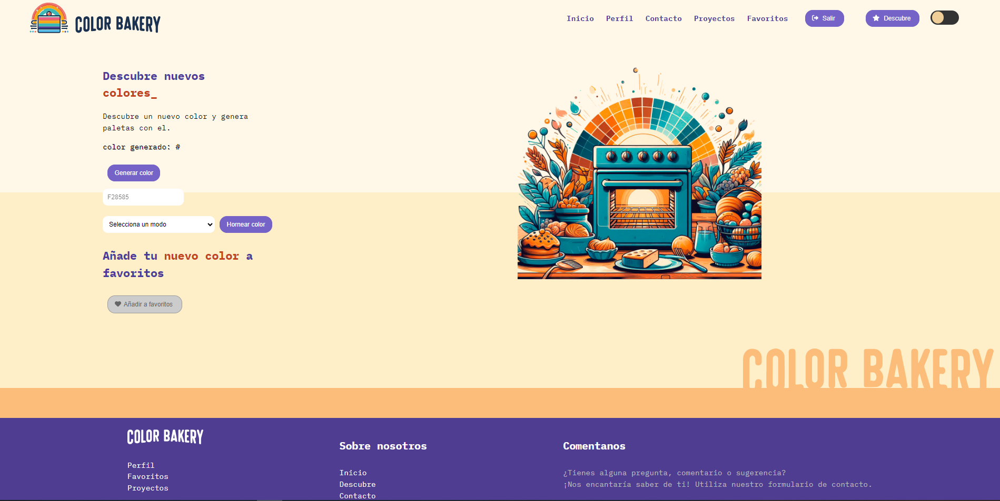

## Proyectos

En el apartado de proyectos el usuario podra crear nuevos proyectos y modificar los ya existentes

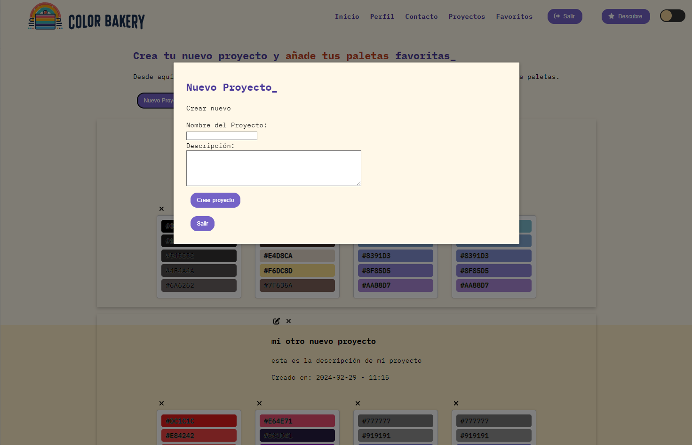

Nuevo proyecto

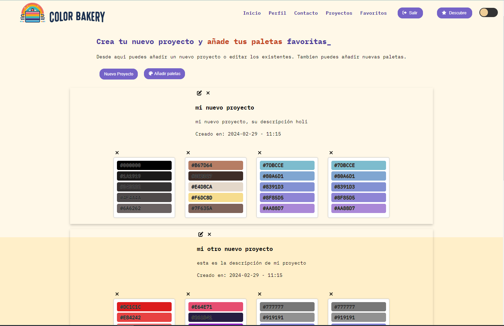

Edicion de proyecto

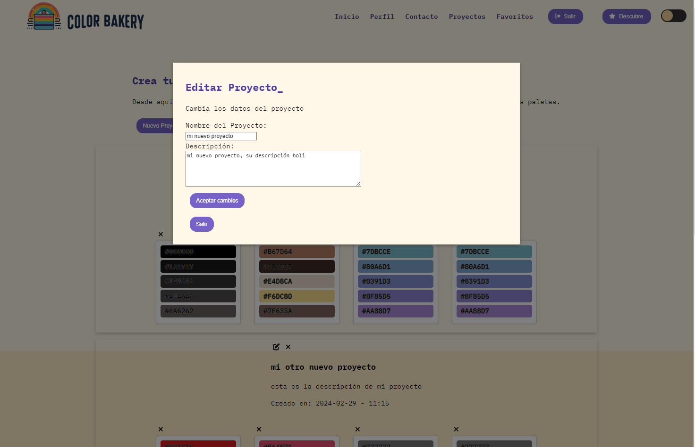

## Formulario de contacto

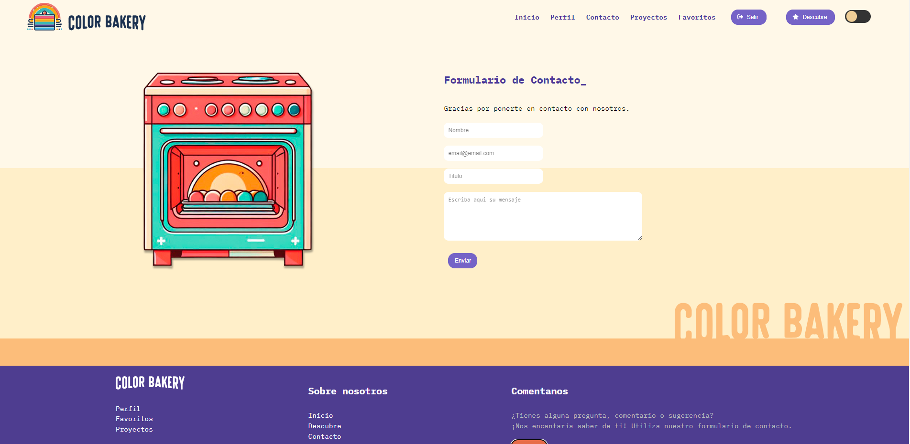

## Favoritos

En el apartado de favoritos el usuario podra guardar los colores de descubre

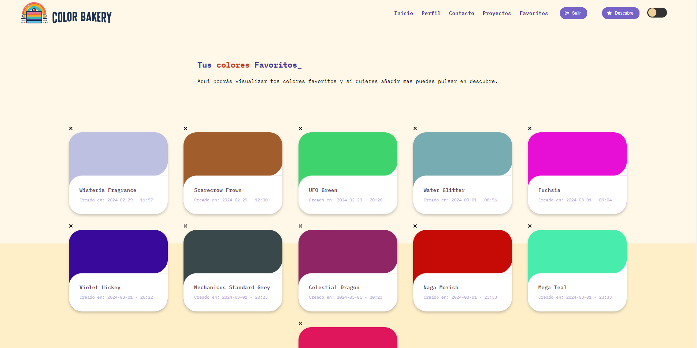

# Desarrollo de la aplicación

- Componentes de Vue.js: 
En el código, se definen varios componentes de Vue.js, 
como ResultadoColor, ResultadoImagen, Descubre, Favoritos, entre otros. 
Estos componentes están estructurados en carpetas por funcionalidad y se componen de principalmente de propiedades y 
métodos.

# Reflexión sobre el desarrollo de la aplicación

Durante el desarrollo del proyecto ColorBakery, 
me enfrenté a una serie de desafíos y aprendizajes significativos que contribuyeron 
al desarrollo final de la aplicación. Aquí comparto algunas reflexiones sobre el proceso de desarrollo:

### Aprendizajes:

Principalmente he aprendido a integrar tecnologías frontend como Vue.js con
tecnologías backend como Laravel. Esta integración me ha permitido desarrollar una aplicación web 
completa con funcionalidades avanzadas.

- La gestión de los estado: A través de Pinia de Vue he profundizado en el aprendizaje sobre gestionar el estado de la aplicación 
de manera eficiente, facilitando la comunicación entre componentes y la 
actualización de la interfaz de usuario según las acciones del usuario.

- El consumo de APIs Externas: Integrar APIs externas como TheColorAPI me 
brindó una comprensión más profunda del proceso de solicitud y respuesta HTTP, 
así como de la manipulación de datos JSON devueltos por la API.

- la manipulación de imágenes: A través de bibliotecas como ColorThief, aprendí a 
extraer colores dominantes de imágenes, ampliando mis habilidades en el manejo de datos 
visuales en aplicaciones web.

### Desafíos Superados:

- Validar los datos de entrada: Uno de los principales desafíos fue validar los 
datos de entrada del usuario, especialmente al ingresar colores en formato HEX o RGB y al 
cargar imágenes desde URL. Implementé funciones de validación robustas para garantizar la 
integridad de los datos. Este apartado me llevo mas tiempo de la previsto inicialmente por la cantidad de variables a controlar.

- La gestión de proyectos y paletas de colores: Desarrollar un sistema para que los 
usuarios pudieran crear y gestionar proyectos, así como asociar paletas de colores a 
cada proyecto. Al final, logré implementar una solución que permite a los usuarios 
organizar sus trabajos de manera efectiva en proyectos y favoritos.

- optimización de rendimiento: A medida que la aplicación crecía en funcionalidades, 
me enfrenté al desafío de optimizar su rendimiento para garantizar una experiencia de 
usuario fluida . Implementé técnicas de optimización como la carga diferida de imágenes y 
la minimización de solicitudes de red para mejorar el rendimiento general de la aplicación.

En general, el desarrollo de ColorBakery me ha permitido adquirir nuevas 
habilidades técnicas y conocimiento sobre el framework Vue y en general
sobre como el frontend y el backend trabajan en sinergia, resolver problemas complejos y trabajar en equipo para crear una aplicación web funcional y práctica. Estoy orgulloso del resultado final y ansioso por seguir aprendiendo y mejorando en futuros proyectos.